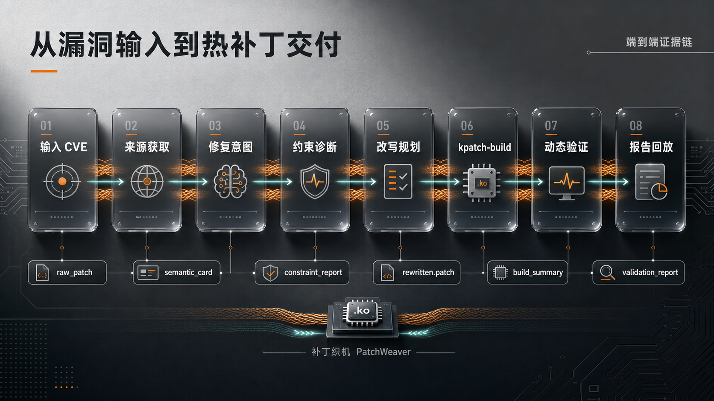
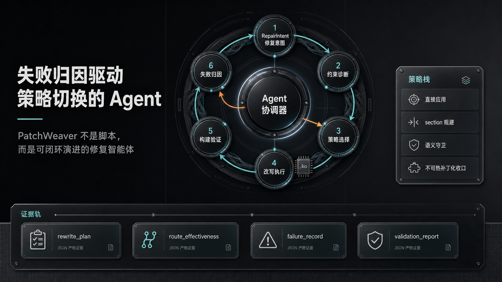
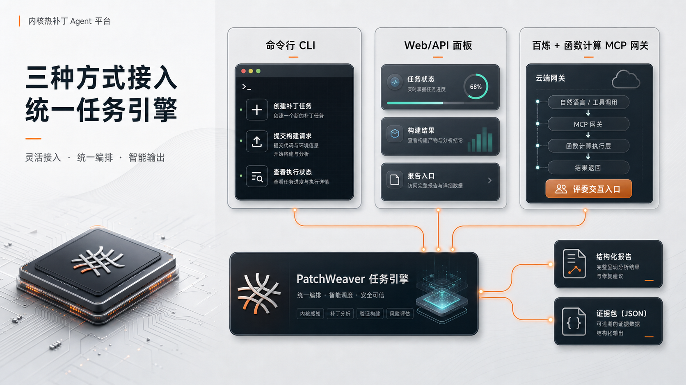
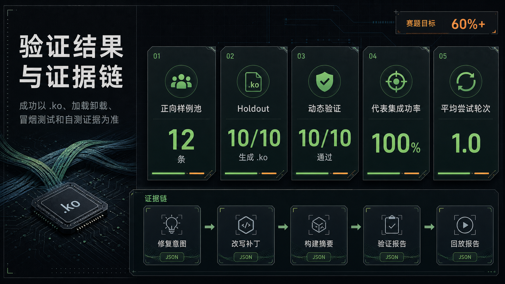

# PatchWeaver

面向 Anolis OS ANCK 内核 CVE 的热补丁自动生成 Agent。

PatchWeaver 的目标是让评委输入一个内核 CVE 后，系统能够自动获取修复补丁、理解修复意图、选择适合 `kpatch` 的改写策略、生成 livepatch `.ko`，并完成加载、卸载、冒烟测试、自测和结构化报告输出。


## 项目简介

PatchWeaver 面向操作系统内核热补丁生成场景，围绕 `CVE -> Patch -> Rewrite -> kpatch-build -> Validate -> Report` 建立完整自动化链路。



系统不是简单执行脚本，而是由 Agent 驱动的工程闭环：

- `CVE` 来源获取：自动定位上游或 stable 修复来源，保存原始 patch 和来源证据。
- 修复意图理解：生成 `RepairIntent`，记录漏洞触发条件、插入点、安全退出路径和必须保留的副作用。
- 约束诊断：识别目标源码状态、模块启用状态、`kpatch` 后端限制和失败原因。
- 改写规划：根据诊断结果选择 `direct_apply`、`minimal_livepatch_wrap`、`section_change_avoidance`、`semantic_guard_rewrite` 等策略。
- 构建验证：调用 `kpatch-build` 生成 livepatch `.ko`，并执行 `load / unload / smoke / selftest`。
- 报告回放：输出 `report.json`、`report.md`、构建日志、验证报告和可回放证据链。



## 快速使用

建议运行环境：

- Python `3.11+`
- Anolis OS 目标内核验证环境
- `kpatch-build`
- 与目标内核匹配的源码树、`.config`、`Module.symvers`、`vmlinux`

安装项目：

```bash
python -m pip install -e . --no-deps
python -m pip install typer pydantic pyyaml jinja2 unidiff rich paramiko fastapi httpx uvicorn pymilvus
```

初始化运行目录和数据库：

```bash
python -m patchweaver init --with-db --json
python -m patchweaver doctor --json
```

运行一个 CVE 任务：

```bash
python -m patchweaver create --cve CVE-2024-26742 --task-id demo-26742 --json
python -m patchweaver analyze --task demo-26742 --json
python -m patchweaver run --task demo-26742 --json
python -m patchweaver report --task demo-26742 --json
python -m patchweaver replay --task demo-26742 --json
```

启动 Web/API 服务：

```bash
python -m patchweaver serve-api --host 0.0.0.0 --port 18084
```

常用 API 能力包括任务创建、任务状态查询、报告查询和 Agent 决策查看。百炼应用可通过 Function Compute 或稳定 HTTPS 网关调用这些接口。



## 效果展示

当前封版验证使用 `v0509` 代表集和 confirmed 正向样例池作为主效果证据；`v0510` 复核证据包用于补充证明近期 7 条真实 full run 均完成 `.ko` 构建与动态验证，且证据缺失数为 0。



| 指标 | 当前结果 |
| --- | --- |
| confirmed 正向样例池 | `12` 条完整证据 |
| Final 风格 holdout | `10/10` 完成 `.ko` 构建 |
| 动态验证 | `10/10` 完成 `load / unload / smoke / selftest` |
| 代表集成功率 | `100%` |
| 平均尝试轮次 | `1.0` |
| 赛题目标参考 | `60%+` 成功率 |

主要证据文件：

- `data/evaluations/validation_v0509/final_holdout10_full_run_v0509.json`
- `data/evaluations/validation_v0509/final_holdout10_evidence_manifest_v0509.json`
- `data/evaluations/validation_v0509/representative_metrics_v0510.md`
- `submission/evidence/patchweaver_review_v0510_evidence.zip`

单个成功样例会保留以下关键产物：

- `repair_intent.json`：修复意图和安全语义。
- `rewritten.patch`：最终进入构建的改写补丁。
- `semantic_guard.json`：语义守卫或改写策略记录。
- `build_summary.json`：构建结果和 `.ko` 产物信息。
- `validation_report.json`：加载、卸载、冒烟测试和自测结果。
- `report.json / report.md`：面向评审和回放的汇总报告。

## 百炼交付入口

PatchWeaver 已提供百炼应用对接所需的 Web/API 与 Function Compute 网关封装。评委可通过百炼应用触发任务，并查看任务状态、构建结果、失败归因和 Agent 下一步决策。

为了保证交付安全，仓库不会保存真实 API Key、服务器密码或平台 Token。正式部署时请通过环境变量、平台 Secret 或云函数安全配置注入密钥。

## 目录说明

```text
patchweaver/                 核心 Python 包
scripts/                     验证、打包、报告和交付脚本
tests/                       单元测试和交付检查
config/                      非敏感配置模板
data/evaluations/            代表集、正向池和测试指标
data/submission/             提交包、脱敏检查和交付产物
docs/                        设计文档、Demo 口径和阶段材料
workspaces/                  单个 CVE 任务的运行产物目录
```

## 许可证

本项目采用 MIT License，见 `LICENSE`。
