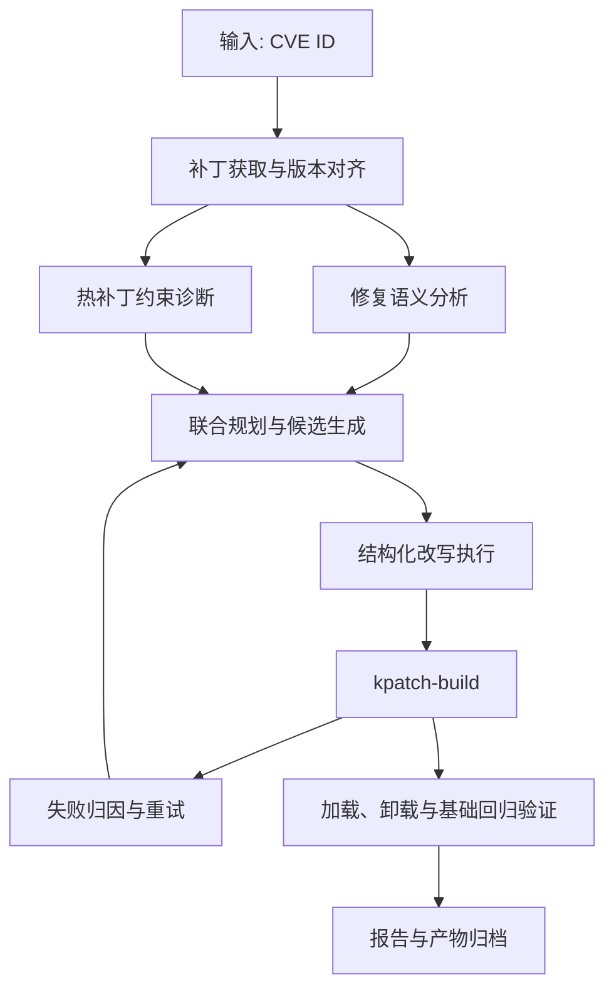

# PatchWeaver 总方案与创新设计总文档

## 1. 项目概述

### 1.1 赛题理解

本题面对的不是“漏洞发现”，而是“热补丁生成”。输入已经是明确的 `CVE ID` 或对应的上游修复线索，系统需要继续完成补丁获取、版本对齐、语义理解、约束适配、构建验证和结果归档。

真正的难点在于三件事必须同时成立：一是上游修复语义不能丢；二是补丁要适配目标内核版本；三是改写结果要满足 `kpatch/livepatch` 的约束并能够成功加载。换句话说，本题本质上是一个受强约束的程序变换与验证问题。

### 1.2 项目目标

`PatchWeaver（补天）` 面向 `Anolis OS ANCK` 内核，输入 `CVE ID` 后自动完成以下流程：

- 获取对应的上游修复补丁
- 对齐到目标内核版本
- 识别修复语义与热补丁限制
- 生成可构建的改写候选
- 调用 `kpatch-build` 进行构建
- 在失败时完成归因并触发下一轮尝试
- 在成功时完成加载、卸载与基础验证
- 输出结构化报告、日志和补丁产物

### 1.3 设计原则

- 以修复语义为边界，任何改写都不能偏离上游修复意图。
- 将约束诊断前置，尽量减少“先构建、再靠日志反推问题”的被动试错。
- 把构建、验证和归档放进同一条闭环，而不是把 `.ko` 产物当作终点。
- 优先保证主链稳定，再逐步提高成功率和自动化程度。

## 2. 总体方案

### 2.1 问题抽象

PatchWeaver 将题目抽象为一条可重复执行的处理闭环：

`CVE -> patch 获取 -> 版本对齐 -> 语义分析 + 约束诊断 -> 候选改写 -> 构建 -> 失败归因/重试 -> 加载验证 -> 报告归档`

在这条链路中，系统需要同时处理两类信息：

- 修复补丁必须保留的语义信息，如关键条件、关键调用、副作用和边界检查。
- `kpatch/livepatch` 不支持或高风险的变更，如 `init` 路径修改、静态数据变化、缺少 `fentry` 的目标函数、结构体布局变化等。

### 2.2 总体流程

### 2.3 关键取舍

项目在设计上做了三点取舍。

第一，不采用复杂的通用多 Agent 平台，而采用“单协调器 + 领域模块”的组织方式。这样更利于控制状态流，也更符合比赛环境下对稳定性和可复现性的要求。

第二，不把大模型放在执行闭环中心。模型负责解释、归纳和给出候选方案，真正的文件改写、命令执行、产物归档由受控模块完成。

第三，不把构建成功作为结束条件。只有在模块可加载、可卸载并通过基础验证后，任务才算真正完成。

## 3. 系统架构

### 3.1 架构组成

系统分为五层：

1. `数据接入层`
   负责 `CVE` 信息、提交记录、补丁文件和目标内核资源的获取。
2. `分析规划层`
   负责修复语义提取、热补丁约束诊断、候选改写规划与排序。
3. `变换执行层`
   负责模板化改写、`SmPL` 改写和受控补丁生成。
4. `构建验证层`
   负责 `kpatch-build`、模块加载卸载、基础回归和语义守卫。
5. `记忆归档层`
   负责失败样例沉淀、经验复用、报告生成和产物管理。

### 3.2 模块说明

- `Retriever`
  建立 `CVE -> upstream commit -> stable commit -> patch` 的对应关系，并保存原始补丁与元信息。
- `Analyzer`
  负责补丁规范化、修复语义提取和 `kpatch/livepatch` 风险识别。
- `Planner`
  根据语义约束和风险项生成改写候选，并按可行性排序。
- `Rewriter`
  将候选方案落地为可执行补丁，执行方式包括模板、`SmPL` 和受控 diff。
- `Builder`
  负责应用补丁、调用 `kpatch-build`、采集构建日志并输出失败类别。
- `Validator`
  负责加载、卸载、基本功能验证和回归检查。
- `Reporter`
  负责 `report.json`、文本摘要、日志索引和产物归档。

## 4. 核心设计与创新

### 4.1 约束与语义的联合建模

仅看补丁文本，很难判断哪些修改是修复漏洞所必需的，哪些修改又会触发 `kpatch` 限制。为此，系统同时建模两类信息。

一类是修复语义，重点关注漏洞根因、必须保留的条件判断、关键调用和副作用。另一类是热补丁约束，重点关注目标函数是否可 hook、数据结构或全局数据是否变化、是否触及 `init` 路径以及是否存在 ABI 风险。

在规划阶段，系统按 `hunk -> function -> call chain -> risk item` 将两类信息连接起来。这样做的目的不是为了做复杂图算法展示，而是为了在候选生成前先筛掉明显不可行的改写路径，把搜索空间控制在一个合理范围内。

### 4.2 热补丁原语库与结构化改写

上游补丁并不天然适合直接转换为 livepatch。PatchWeaver 将 livepatch 官方文档和 `kpatch Patch Author Guide` 中常见的适配手段抽象为一组可复用原语，主要包括：

- `wrapper`
- `callback`
- `shadow variable`
- `state sync`
- `compat adapter`

这些原语并不直接由模型自由组合，而是由规则库和规划器约束其适用条件。执行层采用三种方式协同完成改写：

- 模板化改写，处理高频、边界清晰的适配场景；
- `SmPL/Coccinelle` 改写，处理结构化且适合规则表达的场景；
- 受控 diff 编辑，处理少量无法完全模板化但仍需精确控制的修改。

这使得系统既保留了结构化变换的稳定性，也保留了面对复杂样例时的灵活性。

### 4.3 失败驱动的候选搜索与经验复用

同一类补丁问题通常不止一条适配路径，因此 PatchWeaver 不采用单路径硬改，而是为每个样例生成多个候选方案，并结合下列因素进行排序：

- 风险覆盖程度
- 语义漂移风险
- 编辑半径
- 历史成功率
- 预计构建成本

每一轮失败后，系统不会简单重复上一轮动作，而是先做失败归因，再更新两类记忆：

- `Failure Memory`：记录失败类别、关键证据、触发阶段和无效策略；
- `Recipe Memory`：记录某类问题最终采用何种原语组合、命中位置和成功率。

这种做法的目的，是让系统在比赛过程中逐渐积累可复用经验，而不是让每次失败都从头开始分析。

### 4.4 可信验证闭环

PatchWeaver 将验证分成三个层次。

第一层是模块级验证，确认热补丁模块可以正常加载和卸载。第二层是功能级验证，检查补丁对应的关键行为是否符合预期。第三层是回归级验证，用于发现改写过程中可能引入的新问题。

在这三层之外，系统还保留一层语义守卫，检查关键条件、关键状态更新和关键调用是否仍然存在。这样做的目的，是避免“为了通过构建而牺牲修复语义”的情况。

### 4.5 智能体编排设计

本项目使用智能体，但不把“智能体”本身作为展示重点。对评测而言，更重要的是系统是否稳定、是否可解释、是否可复现。

因此，PatchWeaver 将这部分设计为三层：

- `Prompt` 层负责分阶段约束输出内容，例如语义摘要、风险报告、候选方案和失败解释；
- `Context` 层负责裁剪当前轮真正需要的证据，只提供相关的补丁片段、函数上下文和日志片段；
- `Harness` 层负责结构化输出校验、工具调用、状态机控制、回放和终止条件判定。

这样可以把模型的不确定性限制在可控范围内，避免让整条构建链路受单次生成结果影响过大。

## 5. 关键实现

### 5.1 补丁获取与版本对齐

系统以 `CVE ID` 为入口，优先从稳定分支中定位适用于目标内核的修复提交；若不存在直接可用的稳定分支补丁，则回退到上游提交并生成标准 patch。

在进入分析阶段前，系统会统一补丁路径、编码和 hunk 形式，并对目标源码树做一次基础对齐检查，提前发现明显的 `apply` 冲突。

### 5.2 约束诊断与修复语义提取

约束诊断模块主要识别以下风险：

- `init_code_change`
- `static_local_change`
- `global_data_change`
- `struct_layout_change`
- `header_abi_change`
- `no_fentry_target`
- `unsupported_section_change`
- `inline_side_effect`

语义分析模块则输出一张 `SemanticCard`，记录漏洞类别、根因、必须保留的条件与副作用，以及被修改的关键函数。后续的候选规划必须同时满足 `ConstraintReport` 和 `SemanticCard` 的约束。

### 5.3 候选规划与改写执行

规划阶段会根据风险类型和适用原语生成多个改写候选，再按评分依次尝试。评分时主要考虑风险化解程度、语义漂移风险、修改范围、历史命中效果和构建代价。

执行阶段不直接把模型输出当作最终补丁，而是将候选方案转换为受控改写动作，最终产出：

- `rewritten.patch`
- `rewrite_reason.json`
- `transformation_trace.json`

### 5.4 构建、归因与验证

构建阶段由 `Builder` 统一调度。补丁应用后，系统调用 `kpatch-build`，并对失败结果进行结构化分类，主要包括：

- `patch_apply_failed`
- `compile_failed`
- `modpost_error`
- `missing_fentry`
- `section_mismatch`
- `kpatch_unsupported_change`
- `load_test_failed`
- `semantic_validation_failed`

若构建成功，系统继续执行加载、卸载和基础回归验证；若失败，则将失败类型和证据片段返回规划阶段，驱动下一轮尝试。

### 5.5 结果归档与可复现

每个任务都在独立工作目录下运行，统一保存原始补丁、改写后补丁、构建日志、验证日志、尝试记录和最终报告。对外输出至少包括：

- `report.json`
- `report.md`
- `original.patch`
- `rewritten.patch`
- `build.log`
- `validate.log`

这种组织方式既便于调试，也便于评测阶段复核单个样例的完整证据链。

## 6. 技术路线与交付

### 6.1 技术路线

| 方向 | 选型 | 作用 |
| --- | --- | --- |
| 工作流编排 | `Python 3.11+` | 组织主流程与数据流 |
| 结构化改写 | `SmPL / Coccinelle` | 执行内核代码变换 |
| 内核侧辅助逻辑 | `C` | 承载 wrapper、callback 等原语 |
| 构建与环境控制 | `Bash + Makefile` | 封装 `kpatch-build` 与回放脚本 |
| 数据与报告 | `SQLite + 文件系统` | 管理索引、日志与产物 |
| 验证 | `pytest` + 自定义脚本 | 单元、集成和系统验证 |

模型默认采用 `Qwen` 系列，主要用于语义归纳、候选方案草拟和失败解释，不直接负责最终写入和结果判定。

### 6.2 目标指标

| 指标 | 目标值 |
| --- | --- |
| 热补丁生成成功率 | `>= 70%` |
| 平均尝试轮数 | `<= 4` |
| 模块加载成功率 | `>= 90%` |
| 可复现率 | `>= 95%` |
| 结构化报告覆盖率 | `100%` |

### 6.3 交付物

项目最终交付包括：

- 代码仓库
- 方案设计文档
- 结构化 `JSON` 报告样例
- 构建日志与补丁产物样例
- 测试说明与演示视频

## 7. 期望

PatchWeaver 不是一个“补丁下载 + 构建脚本”的简单流水线，而是一套围绕修复语义、热补丁约束、失败归因和可信验证展开的自动化系统。

对于本题而言，真正决定系统效果的，不只是是否能生成 `.ko`，而是能否在相同输入下稳定复现、能否对失败给出清晰解释、能否证明改写没有偏离原始修复意图。PatchWeaver 的设计正是围绕这三点展开的。
