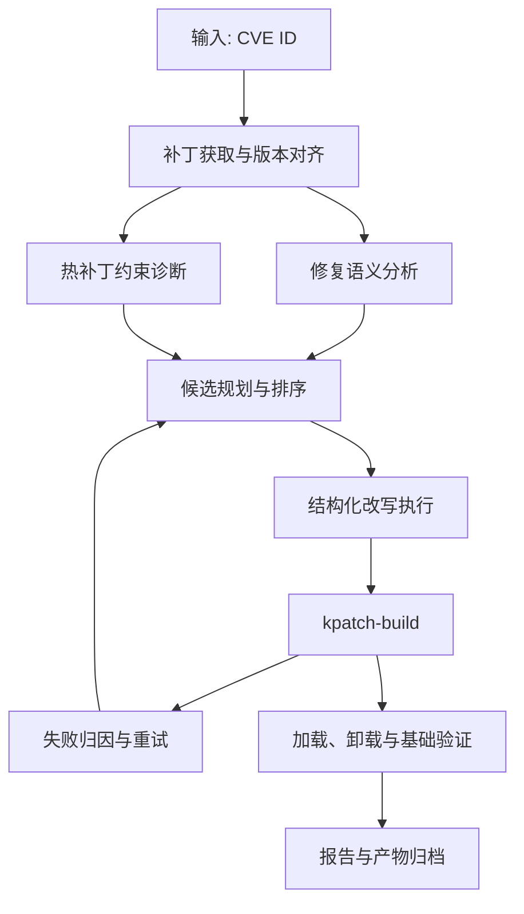

# PatchWeaver 总方案与创新设计总文档

## 1. 项目概述

### 1.1 赛题理解

本题的核心不是漏洞发现，而是面向既有 `CVE` 修复补丁，自动完成热补丁适配、构建验证和结果归档。系统输入通常为 `CVE ID` 或对应的上游修复线索，输出应为可加载的 livepatch 模块、可追溯的过程记录以及可复核的结构化报告。

这一问题同时受三类约束：

- 修复语义不能被破坏。
- 补丁必须能够对齐目标内核版本。
- 改写结果必须满足 `kpatch/livepatch` 的实现约束。

因此，本项目本质上是一个面向内核补丁的受约束程序变换与验证问题，而不是单纯的补丁下载或脚本化构建问题。

### 1.2 项目目标

`PatchWeaver（补天）` 面向 `Anolis OS ANCK` 内核，围绕上游 `CVE` 修复补丁建立自动化闭环，目标包括：

- 自动定位并获取与目标内核相关的修复补丁。
- 自动完成补丁规范化、版本对齐与来源归档。
- 自动识别修复语义和热补丁适配风险。
- 在保持修复意图一致的前提下生成可构建候选。
- 自动调用 `kpatch-build` 构建热补丁模块。
- 在失败时进行结构化归因并驱动下一轮尝试。
- 在成功时完成加载、卸载与基础验证。
- 输出 `report.json`、日志、补丁文件和构建产物。

### 1.3 设计原则

- 语义优先。任何改写都不能偏离上游修复意图。
- 约束前置。尽量在构建前识别高风险变更，减少盲目试错。
- 闭环执行。构建、验证、归因和归档属于同一执行链路。
- 结果可追溯。每轮尝试都应保留补丁、日志、状态和产物索引。
- 工程可落地。优先采用稳定、可复现、便于比赛环境部署的实现方式。

## 2. 总体方案

### 2.1 问题抽象

PatchWeaver 将题目抽象为如下闭环：

`CVE -> 补丁获取 -> 版本对齐 -> 语义分析与约束诊断 -> 候选改写 -> 构建 -> 失败归因/重试 -> 加载验证 -> 报告归档`

在这条链路中，系统需要同时处理两类核心信息：

- 修复补丁中必须保留的语义信息，例如关键条件、关键调用、副作用和边界检查。
- `kpatch/livepatch` 不支持或高风险的变更，例如 `init` 路径修改、静态数据变化、结构体布局变化、缺少 `fentry` 的函数等。

### 2.2 总体流程

### 2.3 关键工程取舍

- 不采用以自由对话为核心的复杂通用多智能体平台，而采用单协调器驱动的模块化架构，降低状态失控风险。
- 不将模型输出直接作为最终补丁，而是先转换为受控改写动作，再由执行模块落地。
- 不将“构建成功”视为任务结束，而要求继续完成加载、卸载和基础验证。
- 不把日志作为唯一诊断依据，而是同时保留结构化失败归因和中间状态记录。

## 3. 系统架构

### 3.1 分层架构

系统整体分为五层：

1. 数据接入层  
   负责 `CVE` 信息、补丁来源、提交记录和目标内核资源获取。
2. 分析规划层  
   负责补丁规范化、语义提取、约束诊断、候选生成与排序。
3. 变换执行层  
   负责模板化改写、规则化改写和受控 diff 编辑。
4. 构建验证层  
   负责 `kpatch-build`、失败归因、模块验证和基础回归。
5. 归档复用层  
   负责任务状态、经验记录、结构化报告和产物管理。

### 3.2 核心模块

- `Retriever`
  建立 `CVE -> upstream commit -> stable commit -> patch` 的对应关系，并归档原始补丁与来源证据。
- `Analyzer`
  负责补丁规范化、修复语义提取和 livepatch 风险识别。
- `Planner`
  根据语义边界和约束信息生成候选改写方案，并进行优先级排序。
- `Rewriter`
  将候选方案转换为可执行补丁，执行方式包括模板、`SmPL` 和受控编辑。
- `Builder`
  负责应用补丁、触发构建、采集日志并输出失败类型。
- `Validator`
  负责模块加载、卸载、基础功能验证和回归检查。
- `Reporter`
  负责 `report.json`、文本摘要、日志索引和产物清单生成。

## 4. 核心设计与创新

### 4.1 修复语义与热补丁约束联合建模

仅根据补丁文本进行改写，容易出现两类问题：一类是遗漏真正的修复语义，另一类是生成触发 `kpatch` 限制的改动。为此，系统在分析阶段同时构建两份结构化描述：

- `SemanticCard`
  描述漏洞根因、必须保留的条件、关键调用和关键副作用。
- `ConstraintReport`
  描述 `init` 路径、静态数据、ABI、函数可 hook 性等 livepatch 风险。

在候选规划阶段，系统以这两份描述作为共同约束，优先筛除明显不可行的改写路径，从源头收缩搜索空间。

### 4.2 热补丁原语库与结构化改写机制

上游修复补丁并不天然适合直接转化为热补丁。PatchWeaver 将常见适配手段抽象为一组可复用原语，例如：

- `wrapper`
- `callback`
- `shadow variable`
- `state sync`
- `compat adapter`

这些原语并不自由拼接，而是由规则库约束其适用条件。执行层采用三类方式协同改写：

- 模板化改写，处理高频、边界清晰的适配场景。
- `SmPL/Coccinelle` 改写，处理适合规则表达的结构化变换。
- 受控 diff 编辑，处理少量无法完全模板化但仍需精确控制的修改。

该机制兼顾了稳定性和适配灵活性。

### 4.3 失败驱动的多轮闭环

同一类补丁问题通常存在多条适配路径，因此系统不采用单路径硬改，而是为每个样例生成多个候选方案，并结合以下因素排序：

- 风险覆盖程度
- 语义漂移风险
- 修改范围
- 历史成功率
- 预计构建成本

每轮失败后，系统先进行结构化归因，再更新经验记录，而不是简单重复上一轮动作。这样可以使后续轮次更快避开无效策略，提高整体成功率。

### 4.4 受控模型调用与证据约束

系统使用模型，但不把模型置于执行闭环中心。模型主要承担以下工作：

- 修复语义摘要
- 候选方案草拟
- 失败原因解释

真正的文件写入、补丁落地、命令执行和结果判定均由受控模块完成。模型输入侧采用证据裁剪和结构化模板，输出侧采用结构化约束和字段校验，以降低不稳定输出对主链路的影响。

### 4.5 可追溯验证闭环

系统将验证分为三层：

- 模块级验证，确认热补丁模块可加载、可卸载。
- 功能级验证，确认关键行为符合修复预期。
- 回归级验证，尽量发现改写引入的新问题。

在此基础上，系统保留语义守卫，对关键条件、关键状态更新和关键调用进行一致性检查，避免“通过构建但偏离修复意图”的情况。

## 5. 关键实现方案

### 5.1 补丁获取与版本对齐

系统以 `CVE ID` 为入口，优先从稳定分支中定位适用于目标内核的修复提交；若不存在直接可用的稳定分支补丁，则回退到上游提交并生成标准 patch。

在进入分析阶段前，系统统一补丁路径、编码和 hunk 形式，并对目标源码树进行基础对齐检查，提前发现明显的 `apply` 冲突。

### 5.2 约束诊断与语义提取

约束诊断模块重点识别以下风险：

- `init_code_change`
- `static_local_change`
- `global_data_change`
- `struct_layout_change`
- `header_abi_change`
- `no_fentry_target`
- `unsupported_section_change`
- `inline_side_effect`

语义分析模块则输出 `SemanticCard`，记录漏洞类别、根因、关键条件、关键调用和关键副作用。后续候选规划必须同时满足 `SemanticCard` 和 `ConstraintReport` 的约束。

### 5.3 候选规划与改写执行

规划阶段会根据风险类型和适用原语生成多个改写候选，再按评分依次尝试。评分时重点考虑：

- 风险化解程度
- 语义漂移风险
- 修改范围
- 历史命中效果
- 构建代价

执行阶段不直接采用自由文本结果，而是将候选方案转换为受控改写动作，最终输出：

- `rewritten.patch`
- `rewrite_reason.json`
- `transformation_trace.json`

### 5.4 构建、归因与验证

构建阶段由 `Builder` 统一调度。补丁应用后，系统调用 `kpatch-build`，并对失败结果进行结构化分类，例如：

- `patch_apply_failed`
- `compile_failed`
- `modpost_error`
- `missing_fentry`
- `section_mismatch`
- `kpatch_unsupported_change`
- `load_test_failed`
- `semantic_validation_failed`

若构建成功，系统继续执行加载、卸载和基础验证；若失败，则将失败类型和证据片段返回规划阶段，驱动下一轮尝试。

### 5.5 状态持久化与结果归档

系统采用 `SQLite + 文件系统` 的混合方式管理运行数据：

- `SQLite`
  保存任务索引、尝试记录、失败分类、验证摘要和产物索引。
- 文件系统
  保存补丁文件、构建日志、验证日志、trace、报告和 `.ko` 产物。

每个任务在独立工作目录中运行，统一保存原始补丁、改写后补丁、构建日志、验证日志、尝试记录和最终报告。这样既便于调试，也便于赛方复核单个样例的完整证据链。

## 6. 技术路线与交付方式

### 6.1 技术路线

| 方向 | 选型 | 作用 |
| --- | --- | --- |
| 工作流编排 | `Python 3.11+` | 组织主流程与数据流 |
| 结构化改写 | `SmPL / Coccinelle` | 执行内核代码变换 |
| 内核侧辅助逻辑 | `C` | 承载 `wrapper`、`callback` 等原语 |
| 构建与环境控制 | `Bash + Makefile` | 封装 `kpatch-build` 与验证脚本 |
| 数据与报告 | `SQLite + 文件系统` | 管理状态、日志与产物 |
| 测试 | `pytest` + 自定义脚本 | 单元、集成和系统验证 |

模型部分采用可控调用方式，主要用于语义归纳、候选建议和失败解释，不直接负责文件写入与结果判定。

### 6.2 目标指标

| 指标 | 目标值 |
| --- | --- |
| 热补丁生成成功率 | `>= 70%` |
| 平均尝试轮数 | `<= 4` |
| 模块加载成功率 | `>= 90%` |
| 可复现率 | `>= 95%` |
| 结构化报告覆盖率 | `100%` |

### 6.3 交付物

项目最终交付包括：

- 代码仓库
- 方案设计文档
- 结构化 `JSON` 报告样例
- 构建日志与补丁产物样例
- 测试说明与演示材料

## 7. 预期效果

PatchWeaver 不是一个“补丁下载 + 构建脚本”的简单流水线，而是一套围绕修复语义、热补丁约束、失败归因和可信验证建立的自动化系统。

对于本题而言，系统价值不只体现在是否生成 `.ko`，更体现在以下三个方面：

- 能否在相同输入下稳定复现。
- 能否对失败给出清晰解释。
- 能否证明改写结果没有偏离原始修复意图。

本项目的总体设计正是围绕这三个目标展开。
