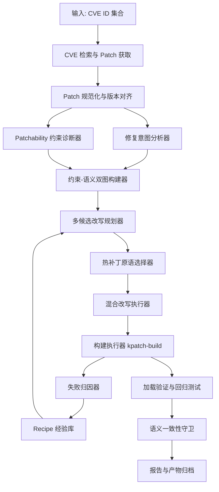

# PatchWeaver 总方案与创新设计总文档

## 1. 文档定位

### 1.1 项目名称

项目名称：`PatchWeaver`

中文名：`补天`

项目全称：面向 `Anolis OS ANCK` 内核的 `CVE` 热补丁自动生成智能体

### 1.2 统一术语与命名约定

- 项目名称统一写作 `PatchWeaver（补天）`
- 输入编号统一写作 `CVE ID`
- 单轮执行过程统一称为“尝试轮”
- 单轮记录对象统一写作 `AttemptRecord`
- 可复用改写单元统一写作 `Recipe`
- 语义补丁规则统一写作 `SmPL`
- 构建命令统一写作 `kpatch-build`
- 最终结构化结果统一写作 `report.json`

### 1.3 设计原则

- 语义优先，改写结果不得偏离上游修复意图。
- 约束前置，尽量在构建前识别不可热补丁化的改动。
- 失败可解释，每轮尝试都要保留失败原因和证据。
- 过程可复现，任务、产物、日志和报告使用统一目录与格式。
- 策略可迁移，规则、原语、Recipe 和经验优先沉淀为通用能力。
## 2. 赛题抽象与外部约束

### 2.1 赛题的工程本质

本赛题的工程本质是一个受强约束的补丁分析、改写与验证系统：

`上游修复补丁`
`-> 修复意图抽取`
`-> livepatch/kpatch 约束建模`
`-> 语义等价改写`
`-> 构建验证`
`-> 失败驱动再规划`

与普通代码生成任务相比，这里有 3 个目标必须同时成立：

1. 修复语义不能跑偏。
2. 改写结果必须满足 `kpatch` 约束。
3. 最终产物必须能构建、能加载、能验证。

### 2.2 赛题关键要求

系统必须至少完成下面这条主链路：

- 输入上游 `CVE ID` 集合
- 查询漏洞公告、修复链路与目标 patch
- 理解 patch 修复意图
- 识别 `kpatch` 不支持或高风险的改动
- 对 patch 做热补丁友好改写
- 调用 `kpatch-build` 产出可加载模块
- 自动完成失败归因、重试、验证和报告输出

### 2.3 比赛过程中的硬约束

- 团队规模为 `1-3` 人
- 允许使用 AI，但必须披露工具、用途和人工审核方式
- 初赛和决赛都要求持续提交过程记录
- 最终作品需要具备开源、可复现和文档完整性
- 评审不只看成功率，也看：
  - 创新性
  - 工程完整度
  - 失败样例解释能力
  - 文档与答辩质量
  - 开发过程真实性

### 2.4 对开发策略的直接影响

这意味着项目需要按可交付系统推进：

- 代码、文档、PPT、视频同步建设
- 每个阶段都有可展示成果
- 每个阶段的验收都同时检查代码、测试记录和配套文档是否随阶段产物同步交付
- 每个样例都有证据链
- 每次失败都能解释并驱动下一轮策略
- 创新点必须能工程落地，而不是只停留在概念层

### 2.5 公开数据集与最终评测集策略

赛题已经明确区分 `Challenge` 与 `Final` 两类数据集，因此总设计也必须对应采用“两阶段策略”：

- `Challenge`
  用于打通主链流程、识别典型难点、沉淀失败归因与改写经验。
- `Final`
  用于最终排名，设计时不能假设其分布、不能围绕已知样例做针对性调参。

因此，本项目的设计原则应固定为：

- 用公开数据集验证“链路能不能跑通、失败能不能解释、经验能不能复用”。
- 用规则、原语、Skill 和 Harness 提高泛化能力，而不是记忆样例答案。
- 所有优化都优先作用于通用流程质量，不把系统做成针对公开样例的特调脚本。

#### 2.5.1 落到实施阶段时的具体做法

两阶段策略需要直接落到分期实施和验收中。

实施安排如下：

| 阶段 | 数据使用重点 | 主要目标 | 明确限制 |
| --- | --- | --- | --- |
| 第一期 | 少量 `Challenge` 代表样例 | 把任务、分析、尝试、报告、回放骨架打通 | 不为单个样例写死逻辑，不追求公开集刷成功率 |
| 第二期 | `Challenge` 典型难点样例集 | 把失败类型抽象成规则、原语、`Recipe` 和经验 | 不允许按 `CVE ID` 做特调分支 |
| 第三期 | `Challenge` 内部拆分出的 `dev / holdout` | 做回归、盲测和泛化检查，模拟 `Final` 压力 | `holdout` 不参与日常调参，不用“看题改题” |
| 第四期 | 固定样例集 + `holdout` 复跑结果 | 封版、收口、准备最终提交与答辩 | 不再接受临时样例特调和大改规则体系 |

在工程上还应同时固定下面 4 条约束：

1. 主链代码中不允许写入面向单个 `CVE` 的硬编码补丁文本、提交号白名单或样例特判。
2. 新增规则、原语或 `Recipe` 时，优先描述“适用于哪类热补丁限制”，而不是“专门修某个样例”。
3. 第三阶段开始，公开集内部要分出一部分 `holdout` 样例，只用于阶段验收和回归，不参与日常调参。
4. 第四阶段提交时，叙事重点应放在“通用流程质量、失败解释能力、经验复用能力”，而不是某几个公开样例的命中结果。

## 3. 项目目标与产品定位

### 3.1 项目总目标

PatchWeaver（补天）的目标不是“把 patch 搬运到 `kpatch`”，重点是构建一个真正完整的热补丁自动生成闭环：

- 理解修复意图
- 识别热补丁约束
- 生成可解释的改写方案
- 自动执行构建与验证
- 对失败进行归因并驱动下一轮尝试
- 输出结构化报告、日志和产物

### 3.2 内部技术指标

内部指标分成“官方达标线”和“内部挑战线”两层：

- `官方达标线`
  - 热补丁生成成功率达到赛题要求的 `60%+`
  - 平均每个 `CVE` 的尝试轮次不超过 `5` 次
- `内部挑战线`
  在公开测例集上进一步追求更稳的结果：

  - 公开测例集成功率达到 `70%+`
  - 平均每个 `CVE` 的尝试轮数控制在 `4` 次以内
  - 模块加载成功率达到 `90%+`
  - 结构化报告覆盖率达到 `100%`
  - 样例回放成功率达到 `95%+`

### 3.3 产品化定位

本项目既面向比赛，也面向真实生产场景验证，因此应同时具备以下产品特征：

- 本地低成本即可运行
- 目标构建环境与赛题环境一致
- 支持失败样例，不只是成功样例
- 输出解释链，而不是只输出 `.ko`
- 正式交付形态可落到 `百炼应用 + 自定义 MCP + FC`
- 具备从“单 `CVE`”走向“批量 `CVE`”的扩展潜力

这里需要明确区分“研发形态”和“交付形态”：

- `研发形态`
  允许先在本地 `CLI / API + Anolis + kpatch` 环境中把主链打通。
- `正式交付形态`
  面向比赛提交时，应补齐 `百炼平台应用链接`，并将构建能力封装为可调用的 `MCP / FC` 服务接口。

#### 3.3.1 赛题百炼应用落地形态

赛题中的“`百炼平台应用链接`”不是文档链接，也不是代码仓库链接，重点是一个可由评委直接打开和体验的百炼应用入口。

结合本项目主链，百炼落地形态按下面 3 层组织：

1. `百炼应用层`
   负责输入 `CVE ID`、选择目标内核、触发任务、展示执行进度、展示最终报告和关键产物链接。
2. `MCP / FC 服务层`
   负责把百炼应用中的操作转成后端可调用能力，例如任务创建、分析、构建、回放和报告读取。
3. `PatchWeaver 主链执行层`
   继续复用本地已经打通的 `CLI / API / BuildOrchestrator / Validator` 主链，不在百炼应用里重复实现构建逻辑。

最小可交付路径如下：

- 用户在百炼应用中输入单个或少量 `CVE ID`
- 应用调用后端服务创建任务并触发主链
- 应用页可查看任务状态、失败归因、`report.json` 摘要和关键日志
- 对固定演示样例，应用页可直接展示对应报告和产物索引

这个设计的目的，是把“赛方要看的应用入口”和“你们已经打通的工程主链”分开：

- 百炼应用负责交互与展示
- `MCP / FC` 负责调用桥接
- PatchWeaver 主链继续负责真实检索、改写、构建、验证和报告

这样做有两个直接好处：

1. 不会为了交一个应用链接，把现有主链重写成另一套平台内逻辑
2. 评委体验到的是统一入口，但你们内部仍然维护同一套可复跑主链

### 3.4 主链能力与增强能力的边界

为了避免方案边界过宽，能力边界分成两层：

- `初赛 / 主链必做`
  `CVE` 检索、patch 获取、语义理解、约束诊断、结构化改写、`kpatch-build` 构建、失败归因、加载验证、结构化报告。
- `中后期增强`
  双记忆优化、更多 `Recipe/SmPL` 模式、批量样例评测、答辩可视化、百炼应用包装。
- `决赛展示增强`
  同模块多 `CVE` 顺序构建、累积热补丁、更多产品化封装与运维化能力。

## 4. 平台环境与技术选型

### 4.1 总体开发形态

开发环境按“双环境”配置：

- `本地开发环境`
  用于代码开发、规则调试、文档与演示联调
- `目标构建环境`
  运行 `Anolis OS + kpatch`，用于真实构建和验证

默认锚定赛题给出的目标环境：

- 操作系统：`Anolis OS 23.4`
- 目标内核版本：`6.6.102-5.2.an23.x86_64`
- 必要配套：`kernel source`、`kernel-devel`、`kernel-debuginfo`、`vmlinux`

### 4.2 推荐硬件平台

| 类别 | 配置 | 用途 |
| --- | --- | --- |
| 开发宿主机 | `x86_64` 8 核 CPU、32GB 内存、500GB SSD | IDE、VMware、容器、本地调试 |
| 主构建虚拟机 | 4 vCPU、16GB 内存、200GB 磁盘 | `Anolis OS 23.4` 构建环境 |
| 验证虚拟机 | 4 vCPU、8GB 内存、80GB 磁盘 | livepatch 加载/卸载验证 |
| 共享存储 | 50GB 以上 | 保存源码包、日志、模块和视频素材 |

### 4.3 核心技术选型

| 方向 | 技术 | 理由 |
| --- | --- | --- |
| 工作流编排 | `Python 3.11+` | 开发快、生态成熟、适合任务流与 JSON |
| 语义改写 | `SmPL` / `Coccinelle` | 最贴 Linux 内核结构化变换 |
| 构建控制 | `Bash` + `Makefile` | 适合封装 `kpatch-build` 和环境重放 |
| 内核侧辅助代码 | `C` | wrapper、callback、shadow state 逻辑需要贴近内核 |
| 服务接口 | `FastAPI` | 便于本地 API 化和后续 MCP 化 |
| 数据模型 | `Pydantic v2` | 强类型、易序列化、适合模块契约 |
| 图建模 | `networkx` | 适合做双图规划与候选搜索 |
| 存储 | `SQLite` | 轻量、适合 3 人团队、本地化友好 |
| 报告生成 | `Jinja2` | 便于输出 `md/json/html` |
| 测试 | `pytest` | 适合单元、集成与流程测试 |

参考 `OpenClaw` 的工程经验，PatchWeaver 在实现层还应坚持一条额外原则：

- 主仓核心保持瘦身，只保留状态机、技能注册、上下文装配、harness 和报告骨架；
- 检索适配器、模型后端、规则包、提示包、Skill 包、`MCP / FC` 接入尽量通过 manifest 化扩展点挂接；
- 不把所有比赛期 idea 直接焊死进主链，以免系统后期变成难以裁剪的“巨型调度器”。

### 4.4 模型选型

采用：

- `Qwen` 系列作为默认模型
- 正式展示形态优先与赛题推荐保持一致，可接入 `百炼` 上的 `Qwen` 系列模型
- 本地开发期可使用同族模型或等价配置做调试，但最终交付口径保持一致
- 复杂语义解释场景允许使用更强模型，但不把模型置于执行闭环中心

模型边界应明确：

- 适合做：
  - patch 语义摘要
  - 候选改写方案草拟
  - 构建日志解释
  - `Recipe` 匹配辅助
- 不适合直接负责：
  - 最终 patch 定稿
  - 最终源码写入
  - 构建是否通过的判定

### 4.5 成本策略

项目完全可以先走“本地低成本开发 + 正式提交前补齐平台化交付”的路线：

- `VMware + Anolis OS + kpatch` 已足够支撑大部分开发与展示
- 研发阶段可先不把全部精力投入云上封装
- 但正式交付阶段必须补齐 `百炼应用链接 + MCP / FC` 这一层，确保与赛题推荐形态一致
- 因此不必在项目早期为平台能力和云成本过度付费

### 4.6 代码风格与注释约定

PatchWeaver 的代码实现统一采用“少而准”的注释策略，不追求表面上写很多说明，重点是让后续接手的人快速看懂类、方法和关键分支。

统一按下面 5 条执行：

1. Python 中的 `class` 和公共 `def` 默认补齐 docstring，先交代这个类或方法是做什么的，再写必要的边界说明。
2. 逻辑较长的方法，不在每一行上方堆说明，重点是在阶段切换、状态判断、关键分支、外部调用前写短逻辑注释。
3. 注释内容尽量贴近真实开发语境，优先解释“为什么这样做”“这里要防什么问题”，少写照着代码就能读出来的空话。
4. 注释语气尽量自然，避免整齐排比、过度抽象或一眼能看出是模型生成的说明腔。
5. 注释中的标点尽量克制，少堆分号、省略号、感叹号和整段机械短句，能一两句说清就不要拉成长段。

进一步约定如下：

- `class` 的 docstring 重点说明职责、上下游关系、核心状态，不要求把每个属性都机械罗列一遍。
- `def` 的 docstring 重点说明用途、关键输入、返回结果和异常边界，简单的 getter、转换器、包装器可以只写一句。
- 对状态机、构建编排、失败归因、上下文装配这类长方法，注释优先写在逻辑块入口，帮助读代码的人先建立分段认识。
- 注释必须跟着实现一起维护。若代码改了，旧注释要一起修，不能留下“看起来很多、实际已经过期”的说明。

## 5. 参考论文与开源项目的创新映射

本项目不做泛泛调研，重点是将外部参考直接映射为系统能力。

| 参考来源 | 借鉴点 | 转化后的创新设计 | 落地位置 |
| --- | --- | --- | --- |
| `Automatic Hot Patch Generation for Android Kernels` | 把热补丁生成视为约束满足问题 | `约束-语义双图规划器` | 改写规划器 |
| `Adaptive Android Kernel Live Patching` | 同一修复可有多种适配路径 | `多候选组合搜索` | 候选生成与排序 |
| `SPINFER` | 从历史变更中归纳语义补丁模式 | `Recipe 经验库` | 经验记忆库 |
| `Coccinelle` | 用结构化规则执行语义级代码变换 | `规则库 + LLM + SmPL 混合改写引擎` | 改写执行器 |
| `kpatch Patch Author Guide` | 列出热补丁限制与高风险修改 | `Patchability 约束诊断器` | 约束分析模块 |
| Linux livepatch 官方文档 | `callbacks`、`shadow variables`、`cumulative patches` 等原语 | `热补丁原语库` | 原语层 |
| `Invalidator` | 编译通过不等于补丁正确 | `静态语义偏移检查` | 验证层 |
| `ExpeRepair` | 经验记忆驱动修复闭环 | `双记忆经验库` | 记忆层 |
| `Linux kernel CVE process` / `linux-cve-announce` / `Linux stable tree` | 修复链路需要权威来源与 stable 优先回溯 | `修复链路解析与稳定分支优先检索策略` | 检索层 |
| `RapidPatch` 等热修复扩展思路 | 为极端约束场景保留优雅降级接口 | `兜底扩展接口` | 扩展层 |
| `DiffKemp` 等语义差异分析思路 | 改写前后要做语义一致性验证 | `语义一致性守卫` | 验证层 |
| `OpenClaw` | 单运行时工作区契约、分层 skill 管理、受限回退状态与瘦核心扩展架构 | `单主工作区 + 分层 Skill Registry + 窄状态 Failover + Manifest 化扩展点` | 编排层 / Skill 层 / Harness 层 |

### 5.1 调研文档关键 Idea 到系统设计的显式映射

为确保 `PatchWeaver-调研参考与比赛策略总文档_v0411.md` 中提出的关键 idea 不停留在“参考资料”层，总设计中固定以下映射关系：

| 调研 / 策略中的关键 idea | 在总设计中的对应能力 | 具体落点 |
| --- | --- | --- |
| 用 `Linux kernel CVE process`、`linux-cve-announce` 和 `Linux stable tree` 校正 patch 来源优先级 | `修复链路解析与 stable 优先检索` | `NVD/cvelistV5 -> 公告/流程 -> stable tree -> upstream` |
| 用 `Patch Author Guide` 生成约束规则库 | `Patchability 约束诊断器` + 风险规则库 | 风险类型、检测规则、禁止动作、对应原语 |
| 用 `Coccinelle` 做结构化改写 | `规则库 + LLM + SmPL` 混合改写引擎 | `SmPL` 执行层、模板层、受控 diff 层 |
| 用 `SPINFER + ExpeRepair` 思想做 `Recipe` 经验库 | `Failure Memory` + `Recipe Memory` | 情景记忆、语义记忆、失败迁移、候选排序 |
| 用 `callbacks + shadow variables` 做创新点 | `热补丁原语库` | 原语选择器、模板化改写、内核侧辅助逻辑 |
| 借鉴 `OpenClaw` 将 workspace、skill、failover、插件边界都做成一等对象 | `单主工作区契约` + `Skill Registry / Router` + `受控 Failover` + `Doctor / Onboard` 工程壳 | `Agent 编排模块`、`Prompt / Context / Harness`、`CLI` 与交付壳层 |
| build 成功后继续做验证闭环 | `三层验证 + 语义一致性守卫` | livepatch selftests、LTP、静态语义偏移检查 |
| 用 `RapidPatch` / `coolbpf` 这类路线作为扩展而不是主线 | `兜底扩展接口` | 决赛期扩展，不进入初赛主链 |
| 比赛期优先做能提效主链的小组件 | 比赛期可交付的小型能力块 | 获取、语义卡片、预检、recipe/SmPL、归因、归档、Prompt/Context/Harness |

### 5.2 比赛期主链组件与 Agent 工程组件到系统架构的映射

调研与策略文档中的比赛期组件，不应作为“额外外挂”，而应直接嵌入当前系统架构。

| 组件 | 在系统架构中的对应模块 |
| --- | --- |
| `CVE 与 patch 获取组件` | `RetrieverService` |
| `语义卡片提取组件` | `SemanticAnalyzer` |
| `kpatch 约束预检组件` | `PatchNormalizer` + `ConstraintDiagnoser` |
| `rewrite recipe / SmPL 执行组件` | `RewriteExecutor` + `SmPL` 执行层 |
| `构建日志归因组件` | `BuildOrchestrator` + `FailureClassifier` |
| `一键构建、验证与归档组件` | `BuildOrchestrator` + `Validator` + `ReportBuilder` |
| `双记忆检索组件` | `Failure Memory` + `Recipe Memory` |
| `语义一致性守卫组件` | `Semantic Guard` |
| `Prompt 模板与结构化输出组件` | `Prompt Compiler` |
| `Context 裁剪与证据装配组件` | `Context Assembler` |
| `Harness 编排与回放组件` | `Harness Orchestrator` + `Replay Harness` |

## 6. 总体架构

### 6.1 总体架构图

配套图片文件：

- `docs/images/总体架构图.png`




### 6.2 中文解释

系统拆成 5 层：

1. `数据接入层`
   负责 `CVE` 元数据、commit、patch 与内核资源获取
2. `分析规划层`
   负责语义理解、约束识别、图建模和改写决策
3. `变换执行层`
   负责把改写方案真正落到 patch 和源码树上
4. `构建验证层`
   负责 `kpatch-build`、模块加载、回归测试和语义校验
5. `记忆归档层`
   负责经验复用、报告生成和产物沉淀

### 6.3 Agent 角色设计

比赛期先不做复杂通用多 Agent 平台，主链采用“单协调器 + 领域 worker”：

- `Coordinator`
  控制状态流和尝试轮数
- `Retriever`
  获取 `CVE`、commit 和 patch
- `Analyzer`
  负责语义理解和约束识别
- `Planner`
  负责候选改写规划与排序
- `Rewriter`
  负责规则、`SmPL` 和模板执行
- `Builder`
  负责构建、日志收集和失败归因
- `Validator`
  负责模块加载和回归测试
- `Reporter`
  负责结构化报告和产物归档

### 6.3.1 Agent 设计模式

PatchWeaver 不采用“多个自治 Agent 并行自由协商”的模式，而采用更适合本题的 `Coordinator-Worker` 设计。

这样做的原因主要有三点：

- 本题是受强约束的工程闭环，状态流必须可控；
- 失败重试必须能够回放，不能依赖隐式对话历史；
- 评测更看重可复现性、证据链和成功率，而不是对话形态本身。

结合对 `Claude Code` 与 `OpenClaw` 的工程研究，可以进一步收敛出一个更适合本项目的原则：

- 主系统必须有唯一状态中心，不能让多个会话式 agent 共同持有主链状态。
- 运行时的关键控制权应落在 `Harness / AttemptEngine`，而不是落在某个模型角色上。
- `多 Agent` 用来描述系统的职责分层；`subagent` 只适合作为局部、受限、临时的辅助执行单元。
- 系统只保留一个主运行时和一个主任务工作区，不为每个 worker 派生独立长生命周期会话。
- `subagent` 的启用必须是白名单阶段、预算受限、结果回流的旁路机制，而不是新的主执行平面。

Agent 设计模式如下：

1. `Coordinator-Worker`
   由 `Coordinator` 统一维护任务状态、尝试轮数、失败类别和终止条件，各 worker 只负责局部阶段。这里的 `Coordinator` 在工程落地上应由 `Harness / AttemptEngine` 承担，而不是再拆成另一个长期自治 agent。
2. `Plan-Execute-Verify`
   先规划，再执行，再验证，避免“边想边改边跑”造成不可追溯。
3. `Failure-Driven Replan`
   每轮失败都必须先归因，再更新候选排序、禁用策略和证据包，随后进入下一轮。
4. `Skill-First Dispatch`
   不是直接把任务交给模型，重点是先由调度层判断当前阶段应调用哪个 `Skill`。
5. `Tool-Guarded Execution`
   文件写入、命令执行、构建验证必须经过 harness 和受控模块，而不是由模型自由决定。
6. `Read-Parallel / Write-Exclusive`
   检索、证据抽取、静态分析等只读步骤可以并发；patch 改写、源码写入、`kpatch-build`、模块加载与卸载必须串行独占。

对 `subagent` 的使用边界也应在这里写清：

- `subagent` 不是“另一个主执行者”，重点是主引擎在局部问题上派生出的受限助手。
- 它更适合做补丁链路侧查、只读证据抽取、失败日志二次归因、报告摘要等旁路任务。
- 它不应直接写最终 patch、不应直接改主源码树、不应直接发起构建和加载，也不应拥有成功/失败判定权。

可以把整体运行模式概括为：

`AttemptEngine / Harness -> Skill Router -> Stage Worker -> Tool / Validator -> Memory / Report`

其中 `subagent` 只作为可选旁路能力挂在 `Retrieval / Failure Analysis / Reporting` 等只读阶段上，而不是进入主改写闭环。

### 6.3.2 Skill 机制设计

在 PatchWeaver 中，`Skill` 不是“额外附加的一段提示词”，重点是一个可复用的领域能力包。它位于 prompt 之上、tool 之下，用来封装某个阶段的稳定知识和执行约束。

从工程边界上看，`Skill` 也不应被理解为“另一个 agent”。更准确的定位应是：

- `Worker` 代表阶段职责；
- `Skill` 代表该阶段的能力包与执行契约；
- `subagent` 只是在必要时被某个 skill 调用的局部辅助单元。

这样可以避免 `Worker / Skill / subagent` 三层都在表达“谁来负责这一步”，从而保持运行时高内聚。

一个完整 `Skill` 至少应包含以下 6 类内容：

1. `触发条件`
   说明什么阶段、什么失败类型、什么风险模式下应优先启用该 skill。
2. `输入契约`
   说明 skill 依赖哪些对象，例如 `PatchBundle`、`SemanticCard`、`ConstraintReport`、失败日志摘录等。
3. `阶段 SOP`
   说明该 skill 的稳定执行步骤，而不是让模型临场自由发挥。
4. `上下文需求`
   说明该 skill 需要哪些证据包，以及证据裁剪的优先级。
5. `输出契约`
   说明 skill 输出的 schema、字段和失败时的降级结果。
6. `回退策略`
   说明 skill 失败时是重试、降级、切换 skill，还是直接交回协调器。

除上述 6 类信息外，工程实现上还为每个 skill 绑定两个附加属性：

- `工具边界`
  明确该 skill 允许调用哪些工具、哪些操作只读、哪些操作必须回交 `Harness` 执行。
- `预算边界`
  明确该 skill 可使用的证据预算、token 预算和是否允许派生只读 `subagent`。

参考 `OpenClaw` 的 Skill 工程经验，PatchWeaver 的 skill 体系还应增加三条硬约束：

- 技能注册必须区分“可见性”和“允许执行”两层，不能因为一个 skill 被发现就默认允许上链执行。
- 技能来源应区分 `workspace > project > shared > builtin` 四层优先级，允许项目级规则覆盖共享默认值，但不允许绕过安全边界。
- skill loader 只负责加载 manifest、契约和资源引用，真正的调度授权仍由 `Skill Router + Harness` 完成，避免 skill 自己膨胀成第二套控制平面。

在本项目中，首批 Skill 覆盖以下阶段：

- `Retrieval Skill`
  负责 `CVE -> 公告 -> stable -> upstream` 链路解析与 patch 获取。
- `SemanticCard Skill`
  负责提取漏洞根因、关键条件、关键副作用和关键调用。
- `Constraint Diagnosis Skill`
  负责把 patch 转成结构化热补丁风险项。
- `Rewrite Recipe Skill`
  负责为风险类型匹配 `recipe / primitive / SmPL` 候选。
- `Failure Analysis Skill`
  负责从构建日志中提取失败类别、证据片段和下一轮禁用动作。
- `Validation Skill`
  负责组织模块级、功能级和回归级验证。
- `Report Skill`
  负责总结本轮尝试、证据链和最终产物说明。

这里要明确几个边界：

- `Prompt` 负责表达当前阶段该怎么说；
- `Skill` 负责表达当前阶段该怎么做；
- `Recipe` 负责表达某类 patch 问题该怎么改；
- `Rule` 负责表达什么是允许的、什么是禁止的；
- `Tool` 负责真正执行受控操作。

因此，Skill 的价值不在于“让模型更像 Agent”，而在于把可复用的阶段知识、调用顺序和回退逻辑沉淀下来，减少 prompt 漂移和人工反复调试，并把局部 `subagent` 使用约束在明确预算与只读边界之内。

### 6.3.3 提示词工程设计

本项目的提示词工程不应理解为“写一个很长的大 prompt”，而应理解为一套分层提示契约：

1. `System Contract Prompt`
   定义模型边界、禁止动作、输出格式和证据引用要求。
2. `Worker Role Prompt`
   分别约束 `Analyzer`、`Planner`、`Rewriter Advisor`、`Failure Analyst` 的职责边界。
3. `Stage SOP Prompt`
   面向“语义提取”“约束诊断”“候选规划”“失败归因”等阶段给出固定分析步骤。
4. `Task Prompt`
   注入当前 `CVE`、目标内核、当前尝试轮、允许原语、失败历史等任务态信息。
5. `Schema Prompt`
   强制输出 `JSON` 或结构化字段，禁止模型直接输出最终 shell 命令或直接改写源码。

设计原则原则如下：

- 模型负责“分析、解释、候选草拟”，不直接拥有最终写文件权限。
- 模型结论必须绑定证据片段，不能只给抽象判断。
- 模型优先输出“候选改写方案 + 理由 + 风险”，而不是直接输出大片补丁文本。
- 模型只能从受控原语集合中做选择，不能发明未登记的热补丁原语。

首批固化 5 类核心 prompt：

- `SemanticCard Prompt`
  输出修复意图、必须保留条件、关键副作用和关键调用。
- `ConstraintReport Prompt`
  输出热补丁风险类型、证据和风险等级。
- `RewritePlan Prompt`
  输出候选原语组合、目标函数、预期收益和语义漂移风险。
- `FailureDigest Prompt`
  输出失败类型、证据片段、下一轮禁止动作和调整方向。
- `ReportNarrative Prompt`
  输出面向报告与答辩的可解释摘要。

### 6.3.4 上下文工程设计

本项目成败很大程度不在于“模型强不强”，而在于“每一轮给模型喂了什么上下文”。

上下文固定拆成 5 层：

1. `Baseline Context`
   固定注入目标内核版本、`kpatch` 约束、可用原语、输出 schema 和禁止动作。
2. `Task Context`
   注入 `CVE` 元数据、目标 commit、受影响文件、当前尝试轮和 profile 配置。
3. `Evidence Context`
   注入 patch hunk、函数签名、调用链摘录、构建日志摘录和约束证据。
4. `Memory Context`
   注入历史命中的 `Recipe`、相似失败模式和成功先例摘要。
5. `Attempt Context`
   注入上一轮候选、上一轮失败类型、已禁用策略和剩余尝试预算。

上下文工程的核心不是“多给”，重点是“只给当前阶段真正需要的证据”。裁剪规则如下：

- 不把整份 patch、整棵源码树、完整构建日志直接塞给模型。
- 检索粒度优先使用 `file -> function -> hunk -> evidence snippet`，而不是整文件拼接。
- 每个证据片段都保留来源路径、函数名、行号区间和所属尝试轮，便于可追溯。
- 当前阶段只取 `top-k` 证据，未命中的大块内容交给 harness 通过工具按需二次拉取。
- 历史记忆只注入摘要和命中理由，不把旧样例原文全部展开。
- 对大 patch 和大日志优先做分块定位、片段抽取和重复读取抑制，而不是整段重复注入。
- 在实现上记录证据来源、token 成本和重复命中情况，为后续压缩、裁剪和回放提供依据。

借鉴 `OpenClaw` 对 bootstrap 文件与长上下文的处理思路，PatchWeaver 在上下文工程中还应补一层“常驻规则包”机制：

- 把系统约束、项目约束、skill manifest、环境事实拆成独立可枚举片段，而不是长期塞进一个巨大 system prompt。
- 对大文件采用“关键片段 + 被裁剪标记”的注入方式，明确告诉模型哪些内容被省略，而不是假装上下文完整。
- 记录每轮已注入的 bootstrap 片段清单，避免跨轮重复注入同一类稳定规则，控制 token 膨胀。

单轮上下文打包产物固定为：

- `PromptPacket`
  当前阶段完整提示包
- `EvidenceBundle`
  当前阶段的证据片段集合
- `AttemptDigest`
  当前尝试的摘要与剩余预算
- `MemoryHit`
  命中的经验条目及适用理由

### 6.3.5 Harness 工程设计

`Harness` 是包在模型外层的确定性执行外壳，用来把本项目从“会聊天的 Agent”变成“可复现的构建系统”。

在本项目中，`Harness` 不只是一个工具包装层，还应承担 `AttemptEngine` 的职责，成为唯一主状态中心。也就是说：

- 所有主链状态只能由 `Harness` 维护；
- `Worker`、`Skill`、`subagent` 都不能各自维护一套独立的主状态机；
- 任何局部委派结果都必须回流到 `HarnessTrace` 再参与下一轮决策。

由 harness 统一负责：

1. 组装 `PromptPacket` 与 `ContextBundle`
2. 调用模型并强制结构化输出
3. 校验 schema、字段范围和禁止动作
4. 决定何时调用检索、改写、构建、验证工具
5. 决定哪些步骤可只读并发、哪些步骤必须写入独占
6. 在必要时为只读旁路任务分配受限 `subagent`
7. 记录完整 trace、artifact 和状态迁移
8. 根据失败类型做重试、降权、禁用和提前终止

单轮 harness 状态机固定为：

`prepare -> analyze -> diagnose -> plan -> rewrite -> build -> classify -> validate -> report`

其中必须明确 3 条边界：

- 成功与失败的判定权归 harness，不归模型。
- 文件写入、命令执行、产物归档由 harness 调度的受控模块完成。
- 同一输入在同一 profile 下，harness 应保证上下文装配、schema 校验和终止条件一致。
- `subagent` 只能执行被 harness 明确批准的局部只读任务，不能绕过主状态机直接落地关键动作。

另外，参考 `OpenClaw` 的 failover 设计，PatchWeaver 的失败回退不应被实现成“失败了就随便换模型重试”，而应是由 harness 维护的一套窄状态切换机制：

- 允许回退的字段仅限于模型档位、提示档位、超时和并发预算等直接调用参数。
- 回退不应隐式改写任务状态、规则集、工作区内容或已记录的失败归因。
- 每次回退都必须记录触发原因、切换前后配置和是否影响结果判定，保证可回放、可解释。

harness 首批实现 4 个关键能力：

- `Schema Guard`
  校验模型输出字段、枚举值和必填项。
- `Policy Guard`
  拦截越权原语、危险动作和超预算上下文请求。
- `Replay Harness`
  支持对同一任务重放每一轮上下文、输出和构建结果。
- `Eval Harness`
  对固定测例集批量评估成功率、平均尝试轮次和失败分布。

### 6.4 端到端运行流程

1. 输入 `CVE ID`
2. 查询 `NVD`、`linux-cve-announce` 与 `linux stable`
3. 获取适用于目标内核版本的 patch
4. 完成 patch 规范化与版本对齐
5. 生成修复语义边界
6. 识别 `kpatch/livepatch` 风险约束
7. 生成多候选改写方案并排序
8. 在目标源码树执行改写并调用 `kpatch-build`
9. 若失败则归因并驱动下一轮尝试
10. 若成功则完成加载、卸载和回归验证
11. 输出 `report.json`、文本报告、日志和构建产物

## 7. 核心创新设计

### 7.1 创新点一：约束-语义双图规划器

核心问题：

- 哪些变更是修复语义必须保留的
- 哪些变更是 `kpatch` 当前不能直接接受的
- 两类信息如何同时参与改写决策

创新做法：

- 构建 `语义图`
  表示修复意图、关键条件、关键副作用和关键调用链
- 构建 `可热补图`
  表示变更函数、数据结构、section、fentry 可 hook 性、ABI 风险、init 路径风险
- 通过同一 hunk、同一函数、同一调用链把两张图连接成联合规划图

创新价值：

- 构建前就能预判热补丁难点
- 支持对同一 patch 搜索多种改写路径
- 有利于解释“为什么这样改”

### 7.2 创新点二：热补丁原语库

创新做法：

把 livepatch 官方文档中的合法技术手段抽象成一组可计算原语：

- `wrapper`
- `callsite redirection`
- `shadow variable`
- `callback`
- `state sync`
- `compat adapter`

创新价值：

- 系统不再只是 patch 改写器
- 而是更接近“理解 livepatch 语义的 patch 编译器”

### 7.3 创新点三：规则库 + LLM + SmPL 混合改写引擎

创新做法：

把改写过程拆成 3 层：

1. `规则层`
   决定风险对应哪些原语和禁忌
2. `规划层`
   由模型辅助生成候选改写方案，但不直接输出最终 patch
3. `执行层`
   由 `SmPL + 模板 + 受控 diff 编辑` 完成真正落地

创新价值：

- 规则保底
- 模型补灵活性
- 结构化执行保稳定性

### 7.4 创新点四：失败驱动的 Recipe 经验库

创新做法：

建立两层记忆：

- `Failure Memory`
  记录失败日志、失败类型、证据片段和失败阶段
- `Recipe Memory`
  记录某类失败最终采用了哪种改写原语、命中函数和成功率

创新价值：

- 同类失败不必每次从零分析
- 可把公开测例经验迁移到最终评测集

### 7.5 创新点五：语义一致性守卫

创新做法：

增加独立守卫层，做三类检查：

1. `静态约束检查`
2. `行为断言检查`
3. `回归验证`

创新价值：

- 把系统从“自动改写器”提升为“可信改写器”

### 7.6 创新点六：多候选组合搜索

创新做法：

对同一个样例一次生成 `K` 个候选方案，按得分排序：

- 最小改动优先
- 历史成功率优先
- 语义最稳优先

创新价值：

- 避免单路径押注
- 在有限尝试轮数下提升成功率

### 7.7 创新点七：支持累积热补丁与补丁升级

创新做法：

- 第一阶段支持单 `CVE`
- 第二阶段支持同模块多 `CVE` 顺序构建
- 第三阶段探索 cumulative patch 打包能力

边界说明：

- 该方向不进入初赛主链验收的必做范围
- 更适合作为决赛期的产品化增强项与展示项

创新价值：

- 更贴近真实生产环境
- 更利于决赛展示产品化能力

## 8. 系统模块设计

### 8.1 CVE 检索与 Patch 获取模块

职责：

- 输入 `CVE ID`
- 建立 `CVE -> upstream commit -> stable commit -> patch` 链路
- 获取适用于目标 `ANCK` 版本的 patch

输出：

- `PatchBundle`

关键实现：

- 按 `NVD/cvelistV5 -> linux-cve-announce / Linux kernel CVE process -> Linux stable tree -> upstream git` 的顺序组织修复链路证据
- 优先获取 stable patch，并把 stable 分支修复作为目标内核适配的首选来源
- 若不存在直接 stable patch，则回退到上游提交并生成 `git format-patch`
- 将 commit message、Fixes 链、来源链接和 patch 一并保存，形成可追溯输入证据

### 8.2 Patch 规范化与版本对齐模块

职责：

- 统一 patch 编码、路径和 hunk 格式
- 对 patch 与目标源码树做基础对齐

关键实现：

- 标准化 `a/ b/` 路径
- 标准化 patch 元数据
- 预检查明显 apply 冲突

### 8.3 修复意图分析模块

职责：

- 理解漏洞根因和修复意图
- 提取改写时不能丢失的关键语义

输出：

- `SemanticCard`

关键字段：

- `bug_class`
- `root_cause`
- `must_keep_conditions`
- `must_keep_side_effects`
- `critical_calls`
- `touched_functions`

### 8.4 Patchability 约束诊断模块

职责：

- 将 patch 转换成 `kpatch/livepatch` 风险项列表

风险类型：

- `init_code_change`
- `static_local_change`
- `global_data_change`
- `struct_layout_change`
- `header_abi_change`
- `no_fentry_target`
- `unsupported_section_change`
- `inline_side_effect`

输出：

- `ConstraintReport`

### 8.5 联合图构建与候选规划模块

职责：

- 联合语义边界和热补丁风险
- 生成多候选改写方案

候选评分维度：

- 风险覆盖率
- 编辑半径
- 历史成功率
- 语义偏移风险
- 预计构建成本

输出：

- `RewritePlan`

### 8.6 混合改写执行模块

职责：

- 将 `RewritePlan` 转成真正可执行 patch

执行分层：

1. `模板层`
2. `SmPL 层`
3. `受控 diff 层`

输出：

- `rewritten.patch`
- `rewrite_reason.json`
- `transformation_trace.json`

### 8.7 构建执行与失败归因模块

职责：

- 应用候选 patch
- 调用 `kpatch-build`
- 收集构建日志
- 输出结构化失败归因

失败分类：

- `patch_apply_failed`
- `compile_failed`
- `modpost_error`
- `missing_fentry`
- `section_mismatch`
- `kpatch_unsupported_change`
- `load_test_failed`
- `semantic_validation_failed`

### 8.8 验证与语义守卫模块

三层验证：

1. `模块级`
2. `功能级`
3. `回归级`

语义守卫重点：

- 关键条件是否保留
- 关键资源释放和状态更新是否仍在
- 修复行为是否仍落在原漏洞根因上

推荐验证基线：

- 模块级优先接入 livepatch selftests 和基础加载 / 卸载检查
- 功能级优先接入 smoke test 与 `LTP` 这类标准化回归
- 高风险样例可追加 `DiffKemp` 或同类静态语义差异分析
- 动态验证前先做一轮轻量静态语义偏移检查，避免明显跑偏方案进入后续构建与验证

### 8.9 经验记忆库模块

存储内容：

- 成功改写案例
- 失败日志与失败类型
- 风险类型到原语的映射效果
- 某类 `Recipe` 的成功率

采用双记忆结构：

- `Failure Memory`
  保存失败阶段、失败日志、证据片段和禁用策略，承担情景记忆角色
- `Recipe Memory`
  保存某类问题对应的原语组合、命中位置和成功率，承担语义记忆角色

使用方式：

- 作为规划器排序信号
- 作为模型提示约束上下文
- 作为报告中“为什么这样改”的依据

### 8.10 报告与归档模块

每个 `CVE` 必须至少产出：

- `report.json`
- `report.md`
- `original.patch`
- `rewritten.patch`
- `build.log`
- `validate.log`
- `attempts/`
- `artifacts/`

### 8.11 Agent 编排与服务接口模块

职责：

- 统一调度各 worker
- 维护唯一主状态机
- 协调只读并发与写入独占两类执行路径
- 管理局部只读 `subagent` 的派生、预算与回收
- 支持本地 `CLI`、本地 API 调试
- 面向正式交付时，对接 `百炼应用 + 自定义 MCP + FC` 调用链
- 对模型后端、检索连接器、`MCP / FC` 服务与可选外部能力暴露 manifest 化接入点

关键设计要求：

- `AttemptState`、终止条件、重试策略和最终判定只能由这一层维护。
- `subagent` 只能作为局部辅助能力出现，不能成为并列主执行器。
- 所有旁路分析结果都必须汇总回 `HarnessTrace`，再进入主链下一步。
- 借鉴 `OpenClaw` 的单运行时 / 单工作区契约，本模块只维护一个主任务工作区和一份主上下文索引，不为每个 worker 复制长期工作目录。

### 8.11.1 Skill Registry 与 Skill Router

职责：

- 维护可用 `Skill` 的注册信息、触发条件和输入输出契约
- 根据当前阶段、风险类型、上一轮失败类别和上下文预算选择应启用的 skill
- 在 skill 失败时执行降级、切换和回退
- 在满足条件时，为只读检索、证据抽取、失败摘要等任务分配受限 `subagent`
- 维护 skill 来源层级、版本、可见性和 allowlist 标签

运行逻辑：

- `Coordinator` 不直接把任务交给模型，重点是先交给 `Skill Router`
- `Skill Router` 再决定调用 `Retrieval Skill`、`SemanticCard Skill`、`Rewrite Recipe Skill` 等具体能力包
- 先按 `profile / 阶段 / allowlist / 权限边界` 做过滤，再按 `workspace > project > shared > builtin` 优先级决定最终 skill
- 若阶段内部存在局部只读任务，则由 `Skill Router` 决定是否派生受限 `subagent`
- 每个 skill 的执行结果都要进入 `HarnessTrace`
- 每个 `subagent` 的输出都只能作为证据或摘要输入，不能直接替代主链结果

### 8.11.2 Skill 在本项目中的定位

在工程实现上，Skill 视作“阶段工作流模板”，而不是简单的文本资源。

推荐每个 skill 至少绑定以下资源：

- prompt 模板
- skill manifest
- 输入 schema
- 输出 schema
- 必需证据字段
- 可调用工具列表
- 失败回退策略
- 对应 `Recipe` / `Rule` / `Primitive` 的引用关系
- 可选的只读 `subagent` 模板
- 来源层级与 allowlist 标签

这里还要强调一个实现边界：

- `Skill` 是阶段能力包；
- `subagent` 是 skill 在局部问题上的受限执行手段；
- 两者都不应替代 `Harness` 对主链的最终控制。

### 8.12 Prompt Compiler 模块

职责：

- 将系统提示、角色提示、阶段 `SOP`、任务态信息和 schema 组装成最终 `PromptPacket`
- 为不同 worker 产出稳定的结构化 prompt 版本

输出：

- `PromptPacket`
- `prompt_manifest.json`

关键实现：

- 支持 prompt 模板版本化
- 支持按 `Analyzer / Planner / Failure Analyst` 选择不同提示层组合
- 支持把证据引用占位符渲染为标准字段
- 支持把系统约束、skill manifest、项目约束和环境事实按 bootstrap 片段装配进最终提示包
- 支持对超长规则文件、日志和 patch 摘要进行裁剪，并在提示中保留“已裁剪”标记

### 8.13 Context Assembler 模块

职责：

- 面向不同阶段按预算装配证据上下文
- 控制 patch、源码片段、日志片段和记忆摘要的注入顺序与数量
- 抑制重复证据注入和无效大块上下文膨胀

输出：

- `ContextBundle`
- `EvidenceBundle`

关键实现：

- 以 `function`、`hunk`、`risk item`、`log snippet` 为基本检索单元
- 按阶段采用不同预算策略
- 保留路径、函数名、行号、尝试轮等溯源字段
- 记录证据片段的 token 成本、命中来源和重复命中情况
- 对大 patch、大日志优先做片段定位和摘要裁剪，而不是全量拼接
- 为每轮上下文输出注入清单，明确哪些 bootstrap 片段、规则包和记忆条目真正进入了模型上下文

### 8.14 Harness Orchestrator 模块

职责：

- 驱动单轮和多轮尝试状态机
- 统一执行 schema 校验、策略守卫、工具调用和 trace 记录
- 统一管理只读并发任务、写入独占任务和受限 `subagent` 调用

输出：

- `HarnessTrace`
- `AttemptState`
- `ReplayBundle`

关键实现：

- 单轮结果必须可重放
- 终止条件必须可解释
- 失败重试必须体现“禁用旧策略、引入新证据、更新候选排序”
- 只读任务允许并发，写入、构建、加载和卸载任务必须独占串行
- `subagent` 结果只作为证据输入或摘要输入，不能直接替代主链动作与判定
- 模型失败回退必须采用窄状态切换，只覆盖模型档位、提示档位、超时等调用参数，不隐式污染任务状态与工作区

## 9. 数据结构与关键算法

### 9.1 核心对象

- `PatchBundle`
  表示一个 `CVE` 对应的原始 patch 输入
- `SemanticCard`
  表示修复意图边界
- `ConstraintReport`
  表示热补丁约束分析结果
- `RewritePlan`
  表示某轮改写候选方案
- `AttemptRecord`
  表示一次构建尝试的完整记录
- `ValidationReport`
  表示加载、功能与回归验证结果

### 9.1.1 Agent 工程新增对象

- `PromptPacket`
  表示某一阶段最终送入模型的完整提示包，包含 prompt 版本、阶段名、schema 和引用证据清单
- `ContextBundle`
  表示某轮上下文装配结果，包含基础上下文、任务上下文、证据上下文、记忆上下文和预算信息
- `HarnessTrace`
  表示单轮状态迁移、模型输入输出摘要、工具调用、守卫决策和终止原因
- `AttemptState`
  表示单轮运行中的瞬时状态，如当前阶段、剩余预算、禁用策略和最近失败类型

### 9.2 参考代码：核心数据模型

```python
from pydantic import BaseModel
from typing import List, Literal


class RiskItem(BaseModel):
    risk_type: str
    severity: Literal["low", "medium", "high"]
    evidence: List[str]
    affected_functions: List[str]


class RewriteCandidate(BaseModel):
    candidate_id: str
    primitives: List[str]
    target_functions: List[str]
    expected_risk: float
    expected_semantic_drift: float
    expected_build_cost: float
```

### 9.3 候选评分函数示意

```python
def score_candidate(resolve_score, semantic_drift, edit_radius,
                    history_success, build_cost):
    return (
        0.35 * resolve_score
        + 0.25 * history_success
        - 0.20 * semantic_drift
        - 0.10 * edit_radius
        - 0.10 * build_cost
    )
```

### 9.4 关键算法设计

候选生成算法：

1. 读取 `ConstraintReport`
2. 为每个风险匹配可用原语
3. 基于 `SemanticCard` 过滤不安全方案
4. 生成 `K` 个候选组合
5. 根据打分排序后依次尝试

失败驱动循环：

1. 分类失败类型
2. 提取证据片段
3. 更新 `AttemptRecord`
4. 查询经验库
5. 对上一轮候选做禁用或降权
6. 触发下一轮候选

终止条件：

- 成功构建并通过验证则终止
- 达到 `max_attempts = 5` 则终止
- 连续两轮仅在同类失败上微调且无本质变化时，提前失败退出

上下文装配算法：

1. 读取当前阶段需要的最小字段集合
2. 从 `PatchBundle`、`ConstraintReport`、`AttemptRecord` 和 `Recipe Memory` 中筛选候选证据
3. 按来源可靠性、与当前风险的相关性、token 成本进行排序
4. 生成 `EvidenceBundle`
5. 渲染为最终 `ContextBundle`

Harness 单轮算法：

1. 读取当前 `AttemptState`
2. 组装 `PromptPacket + ContextBundle`
3. 调用模型并执行 `Schema Guard`
4. 若输出不合法，则进入修复提示或回退到默认策略
5. 若输出合法，则驱动改写、构建和验证
6. 记录 `HarnessTrace`
7. 更新禁用策略、经验命中和下一轮优先级
8. 判断继续、成功终止或失败终止

## 10. 质量保障、风险控制与交付设计

### 10.1 官方评审口径与内部质量目标

总设计中的质量目标应先对齐赛题评审口径，再给出内部挑战线。

与赛题评审口径的对应关系明确如下：

- `核心效果（50%）`
  重点看最终评测集上的热补丁生成成功率与加载验证通过比例。
- `正确性与安全性（30%）`
  重点看改写是否保持修复语义、是否引入高风险操作、验证链条是否可靠。
- `工程完整度与可复现性（10%）`
  重点看环境部署、输入输出规范、过程记录与稳定运行能力。
- `文档与 Demo 表现（10%）`
  重点看架构说明、测试说明、失败案例分析和演示材料质量。

在此基础上，内部挑战目标设为：

- 最终交付必须达到赛题要求的 `60%+` 热补丁生成成功率
- 平均每个 `CVE` 的尝试轮次不超过 `5` 次
- 公开测例集成功率尽量达到 `70%+`
- 模块加载成功率达到 `90%+`
- 可复现回放成功率达到 `95%+`
- 结构化报告覆盖率达到 `100%`

### 10.2 测试策略

测试分为四层：

- `单元测试`
  解析器、归因器、规则库
- `集成测试`
  从 `CVE ID` 输入到报告输出的完整链路
- `系统测试`
  在干净 `Anolis` 环境中完成真实构建与加载
- `回归测试`
  对历史成功样例定期回放

此外，参考 `OpenClaw` 的工程壳设计，补充一类 `Doctor / Environment Check` 测试：

- 启动前检查目标内核版本、`kernel-devel`、`vmlinux`、`kpatch-build`、必要脚本与权限是否齐全；
- 在正式跑任务前先输出环境诊断结果，减少把“环境坏了”误判成“Agent 设计失败”。

### 10.3 可复现性保障

- 固定 `Anolis OS 23.4` 与目标内核版本 `6.6.102-5.2.an23.x86_64`
- 用容器或脚本固化工具链版本
- 每个样例使用独立工作目录
- 所有日志和产物自动归档
- 用统一命令一键重放单个 `CVE` 任务
- 提供 `init / doctor / replay` 一类工程壳命令，把环境初始化、依赖校验和单任务重放都做成标准入口

### 10.4 AI 使用披露

单独维护 `AI 使用说明`，内容包括：

- AI 工具名称
- 大模型名称
- 使用场景
- AI 生成的中间成果
- 人工审核方式
- 关键交互记录

### 10.5 产品竞争力总结

与常见“检索 + 改 patch + build”的流水线方案相比，PatchWeaver（补天）的区分度在于：

- 同时建模修复语义与热补约束
- 不是只靠提示词，重点是有明确原语库
- 不是单路径试错，重点是多候选规划和经验复用
- 不只输出 `.ko`，还能输出证据链和解释链
- 把正确性、可解释性和可复现性一起做进去
- 不追求堆叠概念，重点是通过 `单主状态机 + Skill + Harness + 有边界的 subagent` 保证工程收敛
- 吸收了 `OpenClaw` 这类 Agent 工程的优点，但只保留与本题直接相关的工作区契约、技能分层、窄状态回退和工程壳设计，没有把通用助手产品的复杂外壳整体照搬进来

### 10.6 交付物设计

代码仓库交付物包括：

- `agent/`
- `rules/`
- `recipes/`
- `tests/`
- `docs/`
- `docker/` 或 `build_env/`

比赛材料交付物包括：

- 代码仓库链接
- `百炼平台应用链接`
- 百炼应用使用说明和演示入口说明
- `MCP / FC` 服务部署说明或调用说明
- 设计方案文档
- 部署方法说明
- 使用说明
- 进展汇报幻灯片
- 演示视频
- `JSON` 报告样例
- 构建日志与产物样例
- 失败案例分析样例

此外，分阶段验收时不应只验证代码是否可运行，还应同步验收该阶段承诺的设计文档、实施文档、测试记录、样例说明、部署或使用说明、阶段汇报底稿等是否已经随产物交付。缺少必要文档的阶段，不应视为完整通过阶段验收。

### 10.7 分阶段里程碑与实施文档映射

#### 10.7.1 赛程边界与规划原则

本项目的阶段规划虽然需要参考比赛全周期节点，但这份总设计文档只服务“初赛前研发节奏”。因此，所有核心能力、增强能力和展示能力，都按 `2026-06-30` 初赛提交截止时间倒排，不再把后续决赛节点写入当前研发主计划。

总设计中的赛程边界固定如下：

| 赛程节点 | 日期 | 规划含义 |
| --- | --- | --- |
| 题目发布截止 | `2026-04-28` | 第一阶段前半段应完成工程底座和公开样例打通 |
| 决赛测例 / 指标发布 | `2026-05-01` | 第一阶段后半段开始补强可迁移能力，不围绕公开样例做特调 |
| 报名截止 | `2026-05-28` | 第二阶段应在此前后形成真实主链与阶段可演示版本 |
| 初赛作品提交截止 | `2026-06-30` | 第四阶段必须在此之前完成封版、复测和提交材料收口 |

规划时还应坚持 4 条原则：

- 先做主链，再做增强，再做展示层。
- 所有原本打算放到决赛再做的关键 idea，都在初赛前完成首版落地。
- 每个阶段都必须有明确的阶段产物和下一阶段移交清单。
- 每个阶段的结束标志不仅是功能跑通，还包括该阶段所需文档、测试记录和展示底稿同步收口。
- 总设计负责定义“做什么、做到什么程度、何时收口”，分阶段实施文档负责拆成可施工内容。

为避免各阶段实施文档中的工作包编号风格不一致，整套文档统一采用下面这套命名规则：

| 命名格式 | 含义 | 示例 |
| --- | --- | --- |
| `WP-I-xx` | 第一期工作包 | `WP-I-04` |
| `WP-II-xx` | 第二期工作包 | `WP-II-04` |
| `WP-III-xx` | 第三期工作包 | `WP-III-04` |
| `WP-IV-xx` | 第四期工作包 | `WP-IV-04` |

其中：

- `WP` 表示 `Work Package`
- 中间的罗马数字表示所属阶段
- 末尾两位数字表示该阶段内的工作包顺序编号

四个阶段统一按这套方式书写，避免不同阶段出现编号风格混用。

#### 10.7.2 四阶段总表

| 阶段 | 时间边界 | 阶段目标 | 对应实施文档 | 阶段结束标志 |
| --- | --- | --- | --- | --- |
| 第一阶段 | `2026-03-18` 至 `2026-05-20` | 建立工程底座与最小闭环 | `PatchWeaver-研发实施与交付总手册_一期.md` | 仓库、CLI、SQLite、工作区、最小任务链、报告与回放可用 |
| 第二阶段 | `2026-05-21` 至 `2026-06-05` | 用真实链路替换占位实现，形成可连续迭代的真实主链 | `PatchWeaver-研发实施与交付总手册_二期_v0412.md` | 真实 `CVE -> patch -> rewrite -> build -> validate` 主链可跑通，阶段基线固定 |
| 第三阶段 | `2026-06-06` 至 `2026-06-20` | 强化成功率、验证深度、经验闭环与展示控制面首版 | `PatchWeaver-研发实施与交付总手册_三期_v0412.md` | 规则、经验、评测、Web 控制面和批量回放形成首版资产 |
| 第四阶段 | `2026-06-21` 至 `2026-06-30` | 封版冲刺、全量复测、材料收口与提交准备 | `PatchWeaver-研发实施与交付总手册_四期_v0412.md` | 最终作品、文档、视频、演示脚本和提交材料全部冻结 |

从总设计视角看，四个阶段的工作包前缀统一整理为：

| 阶段 | 工作包前缀 | 实施文档 |
| --- | --- | --- |
| 第一期 | `WP-I-xx` | `PatchWeaver-研发实施与交付总手册_一期.md` |
| 第二期 | `WP-II-xx` | `PatchWeaver-研发实施与交付总手册_二期_v0412.md` |
| 第三期 | `WP-III-xx` | `PatchWeaver-研发实施与交付总手册_三期_v0412.md` |
| 第四期 | `WP-IV-xx` | `PatchWeaver-研发实施与交付总手册_四期_v0412.md` |

#### 10.7.3 第一阶段：工程底座与最小闭环

第一阶段解决的是“系统能不能站起来”的问题，对应第一期实施文档。这个阶段不追求高成功率，重点是先把后续阶段赖以迭代的工程骨架做扎实。

这一阶段在总设计层面应完成：

- 固定仓库结构、配置体系、运行目录和数据落盘规范；
- 建立 `CLI`、`init / doctor / replay`、`SQLite`、工作区和报告产物；
- 建立 `Harness / AttemptEngine` 这个唯一主状态中心；
- 打通最小任务链，使系统至少能从输入走到一次构建尝试和一次报告输出；
- 冻结核心对象、阶段接口、目录命名和阶段产物格式。

第一阶段的直接产物应包括：

- 可安装、可执行、可演示的工程骨架；
- 一套稳定的最小任务链；
- 一套可以被第二阶段继续替换内部实现而不改外壳的对象与接口；
- 一份明确的第二阶段移交清单，指出哪些能力仍是占位实现。

#### 10.7.4 第二阶段：真实主链替换与阶段基线固定

第二阶段解决的是“主链是不是真的能做题”的问题，对应第二期实施文档。这个阶段的核心不是继续搭壳，重点是把第一阶段中的占位能力逐步替换成真实能力。

这一阶段在总设计层面应完成：

- 真实 `CVE` 检索、真实 patch 来源链和标准化输入；
- 真实 `unified diff` 改写、apply 预检查和构建前校验；
- 真实远端 `kpatch-build` 触发、日志回收和失败归因；
- 最小真实验证链，包括加载、卸载、冒烟和预检查；
- 初版规则库、`Recipe`、经验库、回放样例和固定测例集。

第二阶段结束时，系统应从“最小可运行工程”推进到“具备继续强化成功率和验证深度的真实主链系统”。

#### 10.7.5 第三阶段：强化验证、经验闭环与展示增强

第三阶段解决的是“怎么在初赛前把系统做稳、做强、做得更完整”的问题。这个阶段的重点不再是补最小链路，重点是围绕成功率、验证深度、经验闭环和控制面首版做强化。

这一阶段在总设计层面完成以下工作：

- 扩充规则库、`Recipe` 和双记忆，使高频失败类型形成可复用处置路径；
- 完善验证链，逐步接入更强的静态 / 动态验证手段；
- 建立批量评测、固定夹具、回放对比和成功率统计；
- 在主链稳定前提下，接入 Web 控制台等展示与运维控制面首版；
- 把原本准备留到决赛期的关键增强项提前做成首版，避免初赛后再大幅返工。

这一阶段的阶段边界是：展示层和控制面只能在主链稳定后进入，不能反向挤占核心修复链路的研发资源。

#### 10.7.6 第四阶段：封版冲刺与交付收口

第四阶段解决的是“如何在初赛提交前把已经做成的系统高质量交出去”的问题。这个阶段原则上不再引入新主线能力，主要做冻结、复测、演示联调和提交材料收口。

这一阶段在总设计层面完成以下工作：

- 固定最终配置、固定样例集和最终演示脚本；
- 完成一次完整复测，保证构建、验证、报告和回放结果一致；
- 收口设计文档、实施文档、测试说明、AI 使用说明和提交材料；
- 准备成功样例、失败样例、回归样例三类演示证据；
- 对命令、日志、截图、视频和 Web / CLI 演示入口做最终核对。

#### 10.7.7 分阶段文档组织方式

从文档体系上，分工固定如下：

- 总设计文档负责写清阶段目标、阶段边界、模块职责、创新设计和赛程节奏。
- 分阶段实施文档负责把对应阶段拆成目录、文件、工作包、测试项、验收标准和排期。
- 阶段实施过程中如有增量补入项，可在阶段收口时单独汇总说明，但不应打乱原有阶段结构和主线边界。


